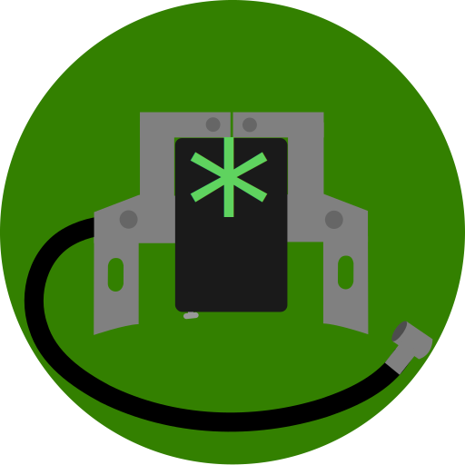

# Ignition

  
  
  
  

<!--     -->

Hit the ground running on your fresh Linux installation.

Download for testing here:

(`sudo snap install ignition --edge --devmode` at the moment)

The Linux world is full of apps. You could be looking for an app that does something, only to find that there are literally hundreds of options. Ignition will show you common apps for certain categories and explain their little nuances in an easy format. Just choose the ones to install, and Ignition will start the engine.

  This app is still in alpha. It isn't fully functional and should only be used for development and testing purposes.

## Status

| Item    | Status     | Description |
| ------- | ---------- | ---------- |
| app     | pre-alpha  | -- |
| run     | good       | `python3 ignition.py` or `./ignition.py` |
| build   | good       | Still confused about this process, but snapcraft builds it fine. |
| publish | **error**  | Learn, debug, work - Error: `/snap/ignition/2/usr/bin/python3: can't open file 'ignition.py': [Errno 2] No such file or directory` |
| backend | *rebuilding* | Rebuilding to use a flexible bash script-based backend. |
| gui     | *rebuilding* | Rebuilding to consist of a better organized category system and a qeue. |
| website | notstarted | To be made on github.io |

## Ideas

### Package Managers

The system would be divided into package manager options. The italicized options would be available later:
- apt
- pacman *(pacman and aur both fall under this name)*
- snapd
- .deb
- flatpak
- .AppImage
- *.rpm*
- *dnf*
- .sh (Custom script)
- *npm*
- *apm*

### App Categories

App categories will be divided like this (maybe with some small revisions):
- Personalization
- Internet
- Media
- Games (little desktop games like solitaire)
- Security
- Office
- Professional (I think this could use a different name)
  - Programming
  - Media Production
  - Gaming (this category is for more serious games like Minecraft and Steam)
  - Super User (aka hacking software and advanced tools)
  - Server (services that can do things for other computers)
  - Engineering
  - More...

  ## Other Useful Resources
  https://wiki.voidlinux.org/Rosetta_stone packagment command stuff.

